# Algotrader (Trader assistant tool)

This tool was created to assist advanced traders with mature strategies, including long-term trends and short-term trade management. With this tool, traders can have a settled mindset, predict the future, and plan for strategies. With a mature strategy, this tool can be used to watch for traders. This tool can provide real-time data collection, analysis, and trade signal monitoring. Thanks to free API providers. This tool has utilized Prophet, SVM, Logistic Regression, and LTSM combined with technical indicators and cash flow as analysis methods. Based on a local PostgreSQL server, this tool has been tested for over 24 hours non-stop. Last but not least, this tool supports the stock market and fits the crypto market. Since the crypto market is open 24 hours a day, most real-time data-related functions were tested in crypto.

# features
* Realtime data collection
  
   - RTstream : Realtime API, get the real-time stock bar from alpaca.

   - RTdata : pull data from local PostgreSql real-time database, and return clean data frame.

   - RTstock: fast way to acquire stock bars, quotes, and trades simultaneously and insert them into the local PostgreSQL real-time database.

   - RTcrypto: the same as stock but in crypto.

    
    

* History data collection

   - Authorization: Onestep API access authorized way, can switch between data only or trading access.

   - CleanData: Onestep clean data and transfer timezone as same as Wallstreet(America/NewYork)

    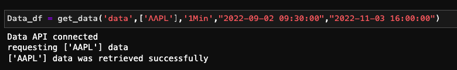

* Database
   - ConnectDB: Onestep connect to the local PostgreSQL database. 

* virtualization
  
   - Dash: display real-time data and chart as a webpage

    

* Trade
  
   - indicators: Onestep indicators calculator, return combined data frame.

   - Trade: Onestep go long or short bracket orders placer
    
    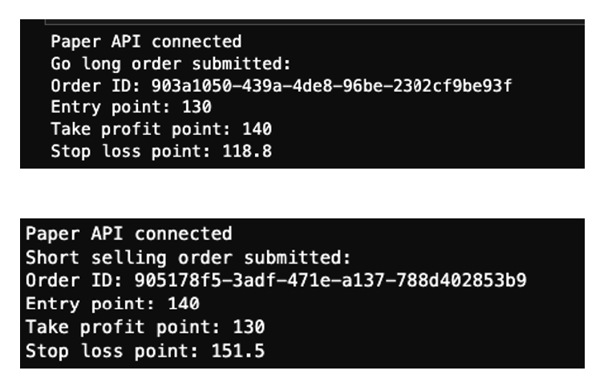
  
   - Signal: real-time data monitoring with pre-set strategies.
  
    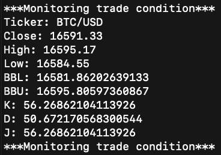

   - Backtest: strategy filled with historical data, strategy evaluator(Logistic Regression created in 'daytrade_models folder,' can use as a entry point condition checker)
  
    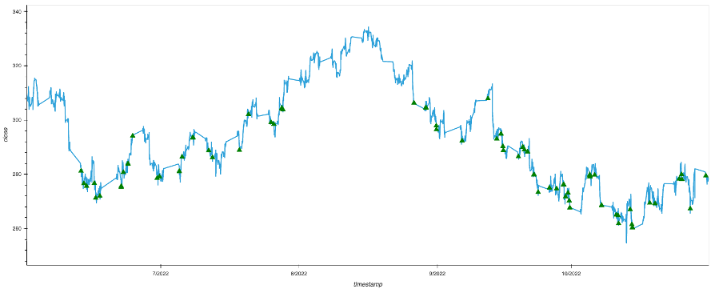

*  Analysis and Machine Learning included
  
   - LSTM: Fit with history and train a module for long-term price prediction purposes. (module saved in 'lstm_models' folder)

    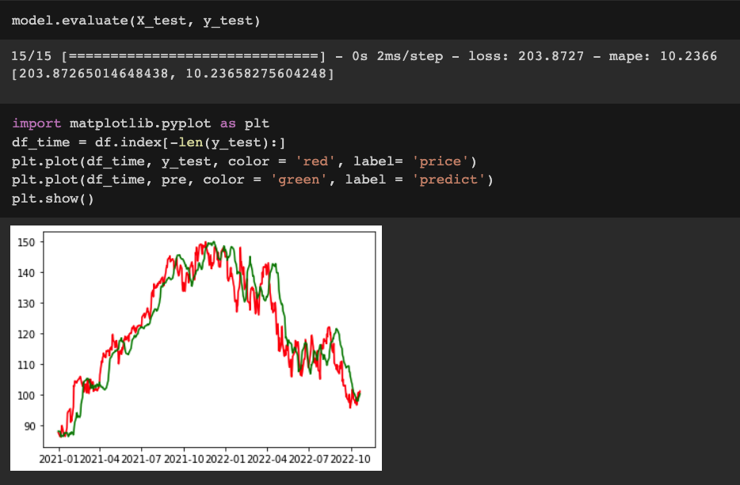

   - ML_SVM: Input daily high and low data, trained a module to predict daily high and low purpose.

    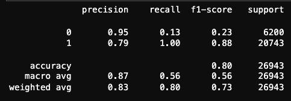
    
- prophet: price prediction over time, next-day chart prediction

    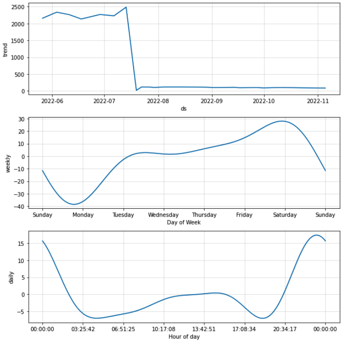
    
LvsS: A tool for comparing bullish and bearish money flows in historical or real-time data. (can use as an entry point condition checker)
    
   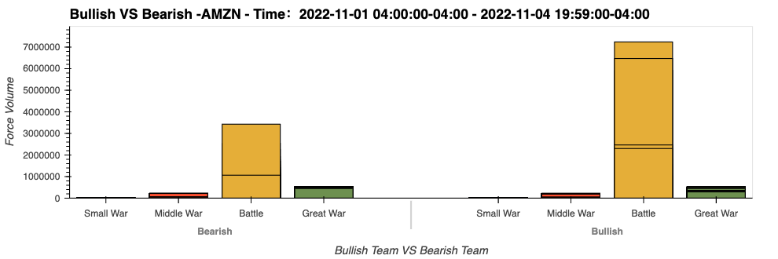

# PostgreSQL DataBase:

   Real-Time Data has been automate seperated by data type:
   
   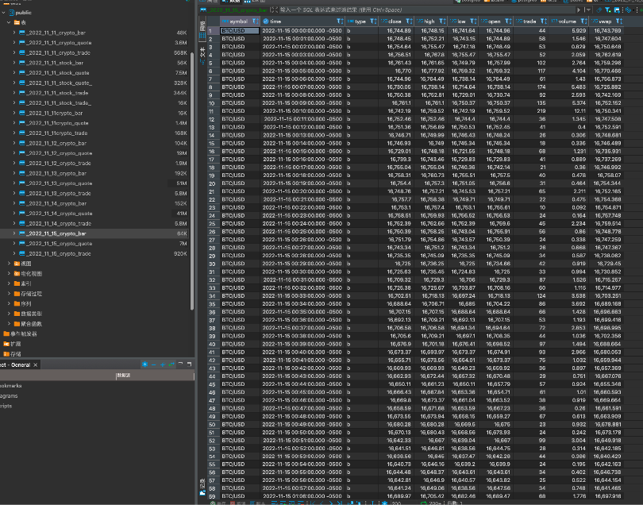

   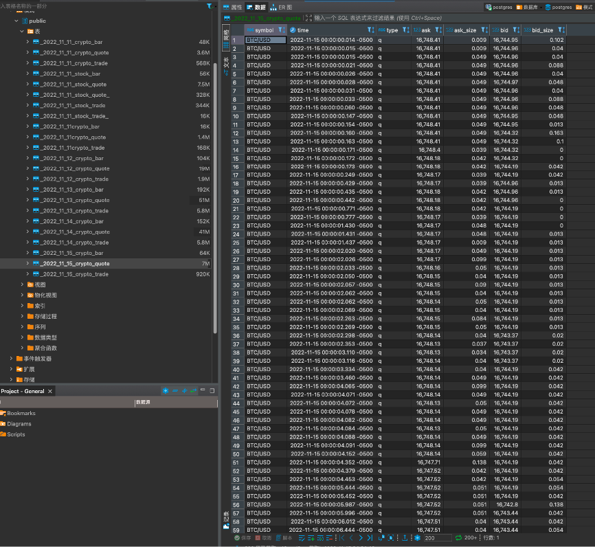
   
   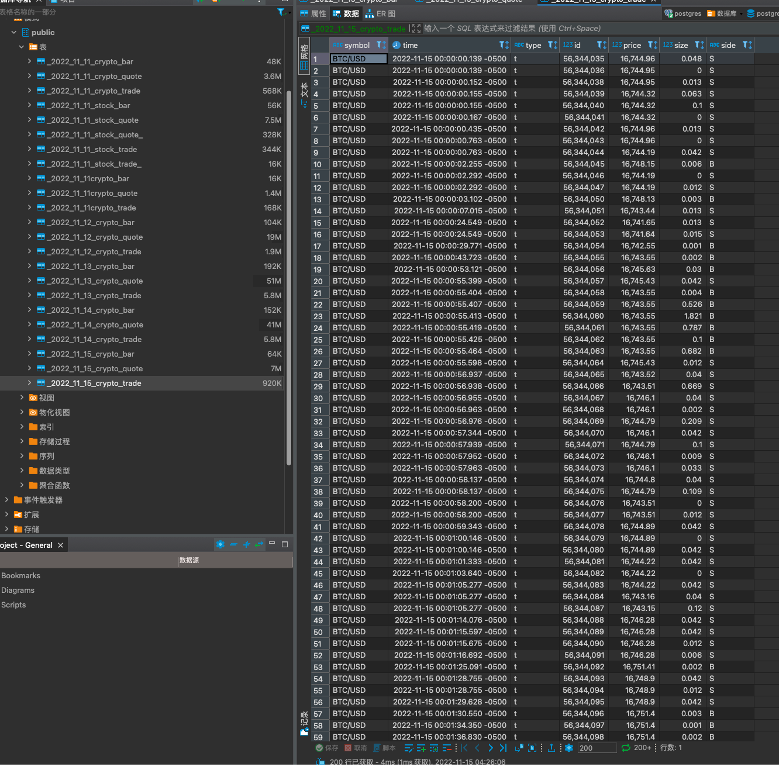

# Consclusion:
 
   Machine Learning can help with trade, but the best, for now, is to treat it as an assistant. For example, all the entry points created by the signal can be further filtered out by a machine-learning model.

   Use left-side columns as features and the result as the target.

   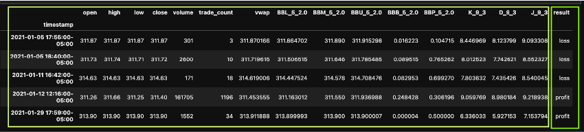

The model successfully identified the loss trade, so I will only conduct the "profit" trade to increase the profit rate.

   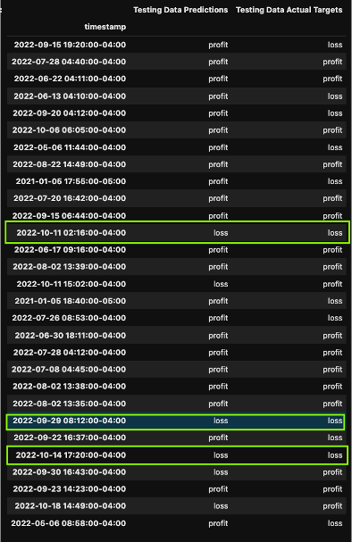

   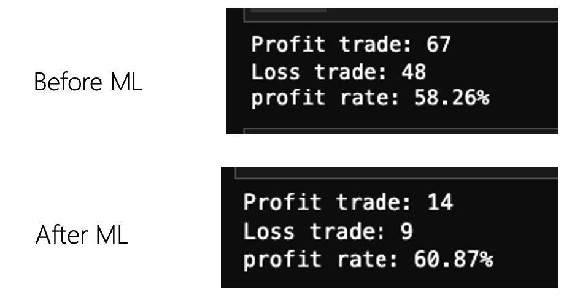


---

Installation Guide

Install the app's dependencies first.The "detail listing" refers to the imported libraries from each file. For example, use ''pip installs" as follows:

```
  pip install pandas
  pip install hvplot
  pip install sklearn
  pip install Dash

```
---

# Useage

Download all the required data and create a local PostgreSQL database

Run any .ipynb with Jupiter notebook or Jupyter Lab.

Use the command line to run any .py files.

---

# Appreciation

FinTech Team Instructor - Tuncay E. Dogan

Special thanks： Dash Panel - FinTech Team TA -  Scott Ferguson


---

# License

[MIT](https://choosealicense.com/licenses/mit/)
  
  
